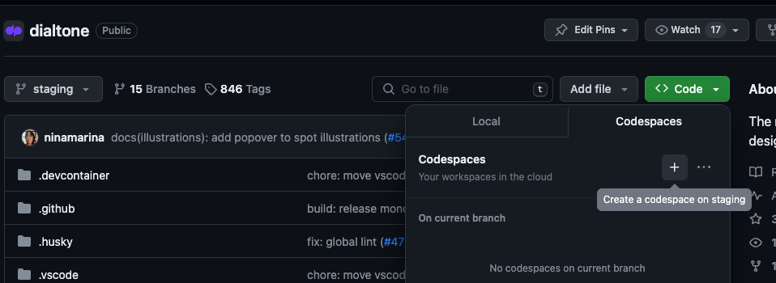

# Dialtone

The monorepo for Dialpad's design system Dialtone.

## About this repo

The @dialpad/dialtone repository is a monorepo composed of Dialtone NPM packages and apps.

The following is a list of packages included in this monorepo. Note that libraries (packages folder) are separated from
apps (apps folder):

```sh
dialtone/
|--- .github                    # Github configuration and workflows
|--- apps                       # Apps
  |--- dialtone-documentation   # Documentation site
|--- packages                   # NPM packages
  |--- dialtone-css             # CSS library
  |--- dialtone-vue2            # Vue component library compatible with vue@2
  |--- dialtone-vue3            # Vue component library compatible with vue@3
  |--- dialtone-icons           # SVG icons library
  |--- dialtone-tokens          # Tokens library
  |--- eslint-plugin-dialtone   # Custom ESLint rules for Dialtone users
|--- scripts                    # Shared scripts
```

## Quick start

If you would like to contribute to Dialtone without having to do any local environment setup, you can use GitHub
Codespaces. You can initialize a new Codespace by clicking the green "Code" button at the top right of the Dialtone
GitHub page.



Please see the [Codespaces docs](./.github/codespaces.md) for more information.

### Local environment setup

- We use [Nx](https://nx.dev/) as build system for improved speed and easier monorepo administration.
  nx is installed as a dev dependency in the root of the project.
- We use [pnpm](https://pnpm.io) for managing workspaces

If you do not have pnpm installed, you can install it with:

```bash
npm install -g pnpm
```

Once pnpm is installed, in the monorepo root run:

```bash
pnpm install
```

This will install the dependencies for all packages.

In order to run dialtone locally, you can use:

```bash
# This will start the server for the documentation site and the library so it is live updated with any changes.
pnpm run start:dialtone
```

Access the local server at `http://localhost:4000`

For dialtone vue 2 storybook and library run:

```bash
pnpm run start:dialtone-vue2
```

Access the local storybook server for Dialtone Vue 2 via `http://localhost:9010/`

For dialtone vue 3 storybook and library run:

```bash
pnpm run start:dialtone-vue3
```

Access the local storybook server for Dialtone Vue 3 via `http://localhost:9011/`

## Local development

Use the `--filter` flag to run commands
for a specific package or app.

### Adding dependencies for individual packages

```bash
pnpm add <dependency> --filter <package/app>
```

To install a local dependency, just add the `--workspace` flag

```bash
pnpm add <dependency> --filter <package/app> --workspace
```

### Running commands for individual packages

You can run commands like `build`, `test`, `start` from
the root of the project with:

```bash
pnpm nx <command> <package/app>
```

Example:

```bash
pnpm nx build dialtone-documentation
```

### Releasing

Running this commands will automatically release all packages that need to be released.

#### Production

Note: needs to be run while on staging branch.

```bash
pnpm run release
```

#### Alpha/Beta

Note: needs to be run while on your feature branch.

```bash
pnpm run release:alpha
```

```bash
pnpm run release:beta
```

## Usage

### Install it via NPM:

```shell
npm install @dialpad/dialtone@next
```

### Import packages:

#### Dialtone CSS

- CSS

```css
@import "@dialpad/dialtone/css";
```

- Javascript

```js
import "@dialpad/dialtone/css";
```

#### Dialtone eslint-plugin

```js
import dialtone from "@dialpad/dialtone/eslint-plugin"
```

#### Dialtone icons

⚠️ *You should avoid importing the icons directly*, please use `DtIcon` vue component instead. ⚠️

In case you cannot use vue components, import the files directly under the `dist/` folder as following:

- Importing icons:

```js
import IconArrowUp from '@dialpad/dialtone/dist/icons/svg/arrow-up.svg';
```

- Importing json files

```js
import keywords from '@dialpad/dialtone/dist/icons/keywords.json';
import iconsList from '@dialpad/dialtone/dist/icons/icons.json';
```

#### Dialtone Vue

- Vue 2

```js
import { DtButton } from "@dialpad/dialtone/vue2"
```

- Vue 3

```js
import { DtButton } from "@dialpad/dialtone/vue3"
```

#### Dialtone Tokens

Dialtone tokens doesn't have a default export, so you need to access
the files directly under the dist/ folder as following:

```css
@import "@dialpad/dialtone/dist/tokens/css/variables-light.css" // Light tokens
@import "@dialpad/dialtone/dist/tokens/css/variables-dark.css" // Dark tokens
```
