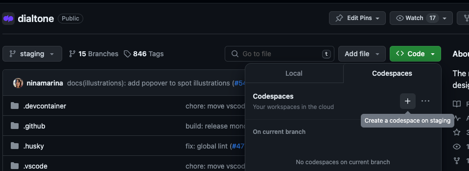

# Dialtone

The monorepo for Dialpad's design system Dialtone.

All separate packages of dialtone are also deployed individually.
If you would like to use an individual package rather than the combined Dialtone package,
you can find documentation for each package in the following table.

## Usage

The below usage instructions are for the combined package.

### Install it via NPM:

#### Using Vue@3

```shell
npm install @dialpad/dialtone @dialpad/i18n
```

#### Using Vue@2

```shell
npm install @dialpad/dialtone @dialpad/i18n-vue2

### Import packages:

#### Without theming

If you don't care about theming and just want to use Dialtone with the default light theme:

- CSS

```css
@import "@dialpad/dialtone/css-default-theme";
```

- JavaScript

```js
import "@dialpad/dialtone/css-default-theme";
```

#### With theming

If you want to use theming, import from the below path. This file does not include design tokens so it is required to also set a theme to apply design tokens to the root element.

- CSS

```css
@import "@dialpad/dialtone/css";
```

- JavaScript

```js
import "@dialpad/dialtone/css";
```

##### Set theme via setTheme() JavaScript function (preferred)

Import the theme you want to use and set it via the `setTheme` function:

```js
import { setTheme } from '@dialpad/dialtone/themes/config';
import DpLight from '@dialpad/dialtone/themes/dp-light';
setTheme(DpLight);
```

Possible themes are as follows:

- DpLight - Dialpad Light
- DpDark - Dialpad Dark
- TmoLight - T-Mobile Light
- TmoDark - T-Mobile Dark
- ExpressiveLight - Marketing Light
- ExpressiveDark - Marketing Dark
- ExpressiveSmLight - Marketing Small Light
- ExpressiveSmDark - Marketing Small Dark

There is an optional second parameter to `setTheme` that allows you to set the theme on a specific element. This is useful in the case of a shadow DOM
when you want to apply the theme to the root element of the shadow DOM rather than the document root. If you do not set this parameter the theme will be applied to the document root.

```js
import { setTheme } from '@dialpad/dialtone/themes/config';
import DpLight from '@dialpad/dialtone/themes/dp-light';
setTheme(DpLight, document.querySelector('#my-shadow-root-host'));
```

##### Set theme manually by importing files

You may want to use this method if you are unable to use JavaScript.

You need to import two tokens files in order to apply a theme. A base tokens files, which is either light or dark, and
a semantic brand tokens file which is named after a brand and theme 'tokens-dp-light', 'tokens-dp-dark', 'tokens-tmo-light', ...

- CSS

```css
@import "@dialpad/dialtone/tokens/tokens-base-light.css" // Base light theme
@import "@dialpad/dialtone/tokens/tokens-dp-light.css" // Dialpad light brand
```

- JavaScript

```js
import "@dialpad/dialtone/tokens/tokens-base-light.css" // Base light theme
import "@dialpad/dialtone/tokens/tokens-dp-light.css" // Dialpad light brand
```

#### Dialtone icons

- Vue 2:

```js
// Named import
import { DtIconArrowUp } from '@dialpad/dialtone-icons/vue2';
import { DtIllustrationBlankSpace } from '@dialpad/dialtone-icons/vue2';

// Default import (Preferred if using webpack as it is tree-shakeable by default)
import DtIconArrowUp from '@dialpad/dialtone-icons/vue2/arrow-up';
import DtIllustrationBlankSpace from '@dialpad/dialtone-icons/vue2/blank-space';
```

- Vue 3:

```js
// Named import
import { DtIconArrowUp } from '@dialpad/dialtone-icons/vue3';
import { DtIllustrationBlankSpace } from '@dialpad/dialtone-icons/vue3';

// Default import (Preferred if using webpack as it is tree-shakeable by default)
import DtIconArrowUp from '@dialpad/dialtone-icons/vue3/arrow-up';
import DtIllustrationBlankSpace from '@dialpad/dialtone-icons/vue3/blank-space';
```

#### Dialtone Vue components

- Vue 2

```js
// Named import
import { DtButton } from "@dialpad/dialtone/vue2"

// Default import (Preferred if using webpack as it is tree-shakeable by default)
import { DtButton } from "@dialpad/dialtone/vue2/lib/button"
```

- Vue 3

```js
// Named import
import { DtButton } from "@dialpad/dialtone/vue3"

// Default import (Preferred if using webpack as it is tree-shakeable by default)
import { DtButton } from "@dialpad/dialtone/vue3/lib/button"
```

#### Dialtine MCP Server

Install the MCP server to use it in your local environment and develop efficiently with Dialtone.
Follow the instructions in the [MCP Server](https://github.com/dialpad/dialtone/tree/staging/packages/dialtone-mcp-server) folder.

## About this repo

The @dialpad/dialtone repository is a monorepo composed of Dialtone NPM packages and apps.

The following is a list of packages included in this monorepo. Note that libraries (packages folder) are separated from
apps (apps folder):

```text
dialtone/
|--- .github                            # Github configuration and workflows
|--- apps                               # Buildable and deployable applications
  |--- dialtone-documentation           # Documentation site
|--- common                             # Common files shared between packages
|--- generator-dialtone                 # Yeoman Generator for creating new packages
|--- packages                           # Libraries that are being developed within the monorepo and published to NPM/GitHub
  |--- combinator                       # Combinator component
  |--- dialtone-css                     # CSS library
  |--- dialtone-emojis                  # Emoji assets
  |--- dialtone-icons                   # SVG and Vue icons library compatible with vue@2 and vue@3
  |--- dialtone-mcp-server              # MCP Server
  |--- dialtone-tokens                  # CSS Tokens library
  |--- dialtone-vue2                    # Vue component library compatible with vue@2
  |--- dialtone-vue3                    # Vue component library compatible with vue@3
  |--- eslint-plugin-dialtone           # Custom ESLint rules for Dialtone users
  |--- language-server                  # Language tools based on Volar Framework
  |--- postcss-responsive-variations    # PostCSS plugin to generate responsive classes
  |--- stylelint-plugin-dialtone        # Custom Stylelint rules for Dialtone users
|--- scripts                            # Shared scripts
```

### Dialtone mono-package

Dialtone is a mono-package that includes many packages within it to ease the maintenance of versions of
the library.

#### How does our bundling works

To achieve this we needed to create certain configs through the monorepo to be able to handle them even if
they have the same package name e.g: `@dialpad/dialtone-vue`.

1. In root [package.json](package.json):
   - `pnpm`:
     - `peerDependencyRules` include `vue": "^2.6 || ^3.2"` to make sure we don't have warnings related to vue version
       mismatch.
     - `packageExtensions` tells pnpm which Vue version to use for each package.
   - `dependencies` doesn't include any specific Vue 2 or Vue 3 dependencies as this causes issues on the client when
     trying to use exports from `./vue2` or `./vue3`.
2. On individual packages `package.json` files:
   - Include the specific dependencies in case someone uses the individual package
   - In `vite.config.js`[Vue 2](packages/dialtone-vue2/vite.config.js),
     [Vue 3](packages/dialtone-vue3/vite.config.js) add dependencies to external to make sure they don't cause
     issues on product. (This is more specific for the Vue 2 package, as product is depending on Vue 2.6 and any
     dependency that needs a newer Vue version will cause issues).
3. In [project.json](project.json)
   - Include implicit dependencies to make sure NX builds them before trying to copy the files to the mono-package.
4. In `gulpfile.cjs`
   - Copy the built files into the root `dist` folder.

#### Included packages

- Dialtone CSS
- Dialtone Tokens
- Dialtone Vue 2
- Dialtone Vue 3

### Tree-shaking

Tree-shaking is a feature that allows you to remove unused code from your bundle, and it is enabled by default in our
build process for Dialtone, Dialtone Vue, Dialtone Combinator and Dialtone Icons.

We achieve tree-shaking primarily via three mechanisms across the packages:

#### Marking packages as side effect free

`sideEffects: false` is set so bundlers can drop unused imports.

- `@dialpad/dialtone` → [package.json](package.json) line 242
- `@dialpad/dialtone-vue` (vue2) → [package.json](packages/dialtone-vue2/package.json) line 145
- `@dialpad/dialtone-vue` (vue3) → [package.json](packages/dialtone-vue3/package.json) line 145
- `@dialpad/dialtone-combinator` → [package.json](packages/combinator/package.json) line 56
- `@dialpad/dialtone-icons` → [package.json](packages/dialtone-icons/package.json) line 98

#### Publishing ESM builds (with dual ESM/CJS via exports map)

Packages expose ESM for bundlers to statically analyze and tree-shake, with CJS fallbacks.

- `@dialpad/dialtone-vue` (vue3):
  - `"type"`: `"module"`,
  - `"module"`: `"./dist/dialtone-vue.js"`,
  - `"main"`: `"./dist/dialtone-vue.cjs"`,

#### Deep, per-module entry points to enable fine-grained import paths

Exports maps expose subpath entries so consumers can import only what they need (which aids tree-shaking and avoids
pulling entire bundles):

- `@dialpad/dialtone` exposes `./vue3/lib/*` and `./vue2/lib/*` map to individual component imports.
- `@dialpad/dialtone-vue` exposes `./lib/*` for individual component imports.
- `@dialpad/dialtone-icons` exposes `./vue3/*` and `./vue2/*` for individual icon/illustration imports.

### Available packages

| Name                                                             | Description                                                                                                                                        | Version                                                                                                   |
|------------------------------------------------------------------|----------------------------------------------------------------------------------------------------------------------------------------------------|-----------------------------------------------------------------------------------------------------------|
| [Dialtone](README.md)                                            | Combined package containing the latest versions of the libraries for ease of use                                                                   |                   |
| [Dialtone CSS](packages/dialtone-css/README.md)                  | Classes or styles used within Dialtone should be stored here and documented on our site under `apps/dialtone-documentation`                        |               |
| [Dialtone emojis](packages/dialtone-emojis/README.md)            | Emoji assets                                                                                                                                       |            |
| [Dialtone icons](packages/dialtone-icons/README.md)              | Resources needed to implement icons on your application that conform to Dialpad’s design principles and best practices                             |             |
| [Dialtone tokens](packages/dialtone-tokens/README.md)            | Design tokens for Dialpad's design system Dialtone and everything related to building and publishing them                                          |            |
| [Dialtone vue 2](packages/dialtone-vue2/README.md)               | Vue components library to simplify and standardize the use of common UI patterns and behaviour across all Dialpad projects (compatible with Vue 2) |               |
| [Dialtone vue 3](packages/dialtone-vue3/README.md)               | Vue components library to simplify and standardize the use of common UI patterns and behaviour across all Dialpad projects (compatible with Vue 3) |          |
| [ESlint plugin](packages/eslint-plugin-dialtone/README.md)       | ESLint plugin containing rules to help developers maintain dialtone recommended practices                                                          |     |
| [Stylelint plugin](packages/stylelint-plugin-dialtone/README.md) | StyleLint plugin containing rules to help developers maintain dialtone recommended practices for CSS                                               |  |

## Contributing

Please read our [contributing guide](.github/CONTRIBUTING.md) **before submitting a pull request**.

### Quick start

If you would like to contribute to Dialtone without having to do any local environment setup, you can use GitHub
Codespaces. You can initialize a new Codespace by clicking the green "Code" button at the top right of the Dialtone
GitHub page.



Please see the [Codespaces docs](./.github/codespaces.md) for more information.

### Local development

#### PNPM

PNPM (Performant NPM) is a package management solution designed to address the challenges posed by
traditional package managers.

We use PNPM to manage everything related to NPM, **adding, installing, removing and publishing packages**.

You will need to install PNPM locally to contribute to this project. <https://pnpm.io/installation>

##### Installation

```bash
npm install -g pnpm
```

##### Do

Use PNPM to manage package dependencies

```bash
pnpm add eslint --filter dialtone-icons
```

##### Don't

Run package scripts with PNPM, this will not use NX cache and pipelines,
so you might end up missing dependencies that needed to be built before.

```bash
pnpm run --filter dialtone-css build
```

#### NX

Nx is a build system with built-in tooling and advanced CI capabilities.
It helps you maintain and scale monorepos, both locally and on CI.

NX manages the scheduling and caching of our PNPM scripts.

We still rely on the package installation and package linking mechanism that PNPM workspaces provide us,
but use Nx instead to **run our tasks in the most efficient way**.

One of the main benefits of adding Nx to our PNPM workspace is speed via caching.

Running commands via NX will enable us to do several things:

- Set up the project dependencies to other projects command,
if they need to run before a specific command.
- Improve the speed of the command execution by saving its output to cache.
- Run the command on the [affected](https://nx.dev/nx-api/nx/documents/affected) projects only.

⚠️ You can run the commands with PNPM too, but it's not advisable as you'll lose the advantages that NX provides.

For more information, check [setup a monorepo with PNPM workspaces and NX](https://nx.dev/blog/setup-a-monorepo-with-pnpm-workspaces-and-speed-it-up-with-nx)

##### Installation

It is recommended to install NX globally via:

```bash
pnpm add --global nx@latest
```

##### Do

Use NX to run scripts, this will use cache, improve the performance,
and build any dependency needed before running your command.

```bash
nx run dialtone-css:build
```

##### Don't

Try installing packages with NX, this doesn't work at all, please use PNPM instead.

```bash
nx add eslint --filter dialtone-icons
```

#### Running the projects

First, install the dependencies for all the monorepo packages and apps.

```bash
pnpm install
```

##### Dialtone documentation site

```bash
nx run dialtone-documentation:start
```

This will start the documentation site and watch the library for changes, it will be live updated with any changes.

Access the local server at `http://localhost:4000`

##### Dialtone Vue 2 storybook

```bash
nx run dialtone-vue2:start
```

Access the local storybook server for Dialtone Vue 2 via `http://localhost:9010/`

##### Dialtone Vue 3 storybook

```bash
nx run dialtone-vue3:start
```

Access the local storybook server for Dialtone Vue 3 via `http://localhost:9011/`

#### Common Commands

##### Production build the root project

```bash
nx run dialtone:build
```

Use the `--filter` flag to run commands for a specific package or app.

##### Adding dependencies for individual packages

```bash
pnpm add <dependency> --filter <package or app name>
```

Example:

```bash
pnpm add eslint --filter dialtone-icons
```

To install a local dependency, just add the `--workspace` flag

```bash
pnpm add <dependency> --filter <package or app name> --workspace
```

Example:

```bash
pnpm add @dialpad/dialtone-tokens --filter dialtone-icons --workspace
```

##### Running commands for individual packages

You can run commands like `build`, `test`, `start` for individual packages from
the root of the project using:

```bash
nx run <package/app>:<target>
```

Example:

```bash
nx run dialtone-documentation:build
```

##### Clean build artifacts and cache

Use this to clear stale build artifacts and reset the build cache. Common scenarios include switching branches, troubleshooting unexpected build behavior, or recovering from interrupted builds. This is rarely needed because build scripts already clean their own dist folders and Nx cache invalidation handles most staleness automatically.

```bash
# Clean everything (dist folders and Nx cache)
pnpm clean

# Clean only dist folders (stale build artifacts)
pnpm clean:dist

# Clean only Nx cache (confused incremental builds)
pnpm clean:cache
```

What gets cleaned:

- `clean:dist` removes `packages/dialtone-tokens/dist` and VuePress cache/temp directories
- `clean:cache` clears Nx's build cache (`.nx/cache`)
- `clean` runs both in sequence

##### Use local package in another project

A way to see local Dialtone changes in a local running frontend is to use a local package.

To create a Dialtone package, first run (in Dialtone repo):

```bash
pnpm pack
```

This will generate a `.tgz` file, with the same format as the one published on npm. To use this package on another project you can run:

```bash
npm install <path to previously generated tgz file>
npm run dev
```

### Releasing

Currently, Dialtone packages are being released in two different ways: `scheduled` and `manually`.
The `scheduled` release will only release changes to `production` while `manually` you can choose to release
`alpha` or `beta` branches.

#### Production

##### Scheduled

On every Tuesday at 10:00 am UTC, [release action](.github/workflows/release.yml) will trigger the production release process which
automatically release all packages that need to be released following the next steps:

1. Run the `release` target on every project.
2. Merge the release commits created by the semantic release bot on `staging` to `production` branch.
3. Push the `production` branch.
4. The [publish action](https://github.com/dialpad/dialtone/actions/workflows/publish.yml) will publish the packages with its corresponding tag.

##### Manually

In case you need to release earlier than the next scheduled date, you can trigger the release via `Run workflow` on [GitHub](https://github.com/dialpad/dialtone/actions/workflows/release.yml).

  1. Select `staging` branch.
  2. Select the `package` that you want to release or leave it empty to release all of them.

This will trigger the [release action](.github/workflows/release.yml), release changes on `staging` and automatically publish the selected packages following the next steps:

1. Run the `release` target on selected packages (all if `package` is empty).
2. Merge the release commits created by the semantic release bot on `staging` to `production` branch.
3. Push the `production` branch.
4. The [publish action](https://github.com/dialpad/dialtone/actions/workflows/publish.yml) will publish the packages with its corresponding tag.

#### Alpha/Beta

1. Merge your changes to the branch you want to release, commit and push to origin. (Note: If your dialtone version number is behind the last production release number, it may fail. Merge in staging or update the version number manually.)
2. Go to [GitHub](https://github.com/dialpad/dialtone/actions/workflows/release.yml) and click on `Run workflow`.
3. Select `alpha` or `beta` branch.
4. Select the `package` that you want to release or leave it empty to release all of them.

This will trigger the [release action](.github/workflows/release.yml), release changes on the selected branch and automatically publish the selected packages following the next steps:

1. Run the `release` target on selected packages (all if `package` is empty).
2. The [publish action](https://github.com/dialpad/dialtone/actions/workflows/publish.yml) will publish the packages with its corresponding tag.

### Testing

#### Run Vue unit tests

```bash
nx run dialtone:test:vue
```

##### Run Vue 2 tests

```bash
nx run dialtone-vue2:test
```

##### Run Vue 3 tests

```bash
nx run dialtone-vue3:test
```

##### Run Vue 2 unit tests with coverage

```bash
nx run dialtone-vue2:test:coverage
```

##### Run Vue 3 unit tests with coverage

```bash
nx run dialtone-vue3:test:coverage
```

These will generate a JSON and HTML report in the `coverage` directory.

##### Test Coverage thresholds

The coverage thresholds are defined in the `vitest.config.ts` file.
When submitting a PR the CI will run the tests with coverage and fail if the coverage is below the thresholds.
