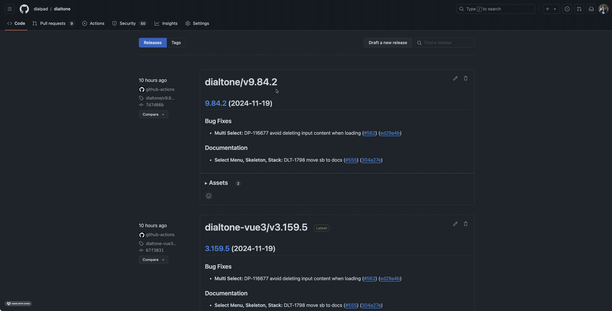
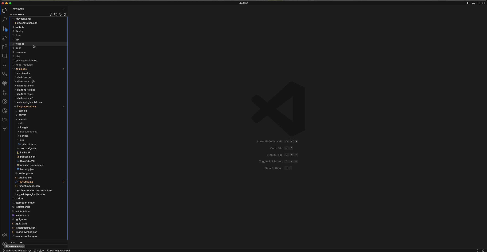

# Dialtone language-tools

This is the Dialtone language tools based on Volar Framework.

## Tools

- pnpm: monorepo support
- esbuild: bundle extension

## Folder structure

- server: Language server.
  - src: Language server source files.
    - resolvers: Process documentation and return completion items array.
    - services: Language service plugins
- vscode: VSCode extension.
  - src: Extension source files.
  - scripts: ESBuild script.
- sample: Test files

## Running the Sample

- Run `pnpm install`. This installs all necessary npm modules in both the client and server folder
- Open VS Code on this folder.
- Switch to the Debug viewlet.
- Select `Launch Client` from the drop down.
- Run the launch config.
- The [Extension Development Host] instance of VSCode, will open the `sample` folder.
  - On a `.vue` file:
    - Type `<dt-|` to trigger Component completion.
    - Type `<dt-avatar | />` to trigger property completion.
    - Type `<dt-avatar size="|" />` to trigger values completion.
  - On a `.css` file:
    - Type `color: var(--dt-|)` to trigger token completion
- If no completion is provided automatically (depends on your VSCode config), press `Ctrl + Space` to trigger the completions.

## Build .vsix

- Run `pnpm nx run dialtone-language-server:pack` in this folder
- `vscode/vscode-dialtone.vsix` will be created, and you can manual install it to VS Code.

## Installing the extension

### Manually

#### Download

1. Go to [Dialtone releases](https://github.com/dialpad/dialtone/releases?q=vscode-extension&expanded=true)
2. Look for the latest version of the plugin.
3. Under "Assets" click the "VS Code extension" link, this will download a `vscode-dialtone.vsix` file.

#### Install

1. Open VS Code.
2. Go to extensions and click the tree dots at the top right.
3. Select 'Install from VSIX'
4. Select the downloaded `vscode-dialtone.vsix` file.
5. You should now see "Dialtone" under extensions.

### Through VSCode marketplace (coming soon)

## References

- <https://code.visualstudio.com/api/language-extensions/embedded-languages>
- <https://github.com/microsoft/vscode-extension-samples/tree/main/lsp-embedded-language-service>
- <https://volarjs.dev/core-concepts/why-volar/>
